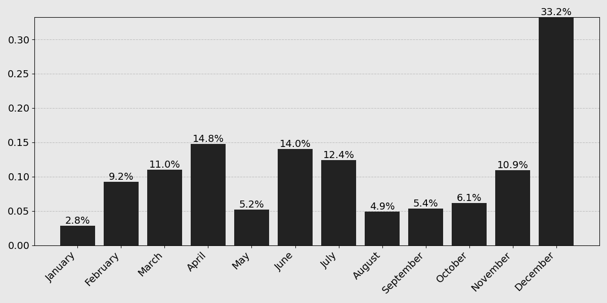

I wrote a decent amount of code this year:

I was curious to see a breakdown of all that activity, so I got to work last night with a Jupyter REPL and Claude in hand. Frustratingly, I was only able to recover 1062/1412 contributions through the API alone, and wasn't able to debug a several hundred commit discrepancy from the over the summer.

Whatever. Also, if you're expecting more pretty pictures like the one above, then you'll be disappointed. This isn't that type of blog. So, without further ado, my __2024 GitHub Wrapped__.

## By The Numbers

### Commits by Repository (>1%)

    <table class="repo-table">
        <thead>
            <tr>
                <th>Repository</th>
                <th>Percentage</th>
                <th>Type</th>
            </tr>
        </thead>
        <tbody>
            <tr>
                <td class="repo-name">tjbai/evolver</td>
                <td class="percentage-cell">26.6%</td>
                <td>Research</td>
            </tr>
            <tr>
                <td class="repo-name">tjbai/ddm</td>
                <td class="percentage-cell">11.8%</td>
                <td>Research</td>
            </tr>
            <tr>
                <td class="repo-name">tjbai/avlm</td>
                <td class="percentage-cell">10.5%</td>
                <td>Class Project</td>
            </tr>
            <tr>
                <td class="repo-name">tjbai/argo</td>
                <td class="percentage-cell">9.8%</td>
                <td>Research</td>
            </tr>
            <tr>
                <td class="repo-name">tjbai/llmr</td>
                <td class="percentage-cell">8.6%</td>
                <td>Class Project</td>
            </tr>
            <tr>
                <td class="repo-name">tjbai/aoc</td>
                <td class="percentage-cell">4.1%</td>
                <td>Personal</td>
            </tr>
            <tr>
                <td class="repo-name">tjbai/neurstat</td>
                <td class="percentage-cell">3.5%</td>
                <td>Class Project</td>
            </tr>
            <tr>
                <td class="repo-name">tjbai/bstat</td>
                <td class="percentage-cell">3.3%</td>
                <td>Class</td>
            </tr>
            <tr>
                <td class="repo-name">tjbai/ji</td>
                <td class="percentage-cell">3.1%</td>
                <td>Personal</td>
            </tr>
            <tr>
                <td class="repo-name">tjbai/cv</td>
                <td class="percentage-cell">2.9%</td>
                <td>Class</td>
            </tr>
            <tr>
                <td class="repo-name">tjbai/blog</td>
                <td class="percentage-cell">2.4%</td>
                <td>Personal</td>
            </tr>
            <tr>
                <td class="repo-name">tjbai/front</td>
                <td class="percentage-cell">2.0%</td>
                <td>Personal</td>
            </tr>
            <tr>
                <td class="repo-name">tjbai/cogai</td>
                <td class="percentage-cell">1.8%</td>
                <td>Class</td>
            </tr>
        </tbody>
    </table>

Unsurprisingly, the top of this list is dominated by some private research repositores (evolver, ddm, argo) along with a couple course projects from this past semester (avlm, llmr). Collectively, those repos are exclusively language model-related research projects. Sign of the times.

Past that, there's a steep fall off and the rest is a mix of random homework repos (bstat, cogai, cv) or personal websites/productivity tools (blog, front, ji). It's funny to see my [Advent of Code](https://en.wikipedia.org/wiki/Advent_of_Code) repo (aoc) in 6th place, considering all those commits were exclusively made during a 2-3 week period at the start of December.

## Work Patterns

### Commits by Month

There was a steady ramp-up last spring as I got deeper into a project with Jason, interrupted by a steep drop-off near finals, followed by a couple grindy months double-timing work and research in Austin, right into a predictably heavy burnout this past fall. I did manage to get my swagger back to close out the year though between Advent of Code, course projects, and getting back into research.

### Commits by Day

I love this chart. I always attack the week with a full head of steam, regress to my normal levels of productivity mid-week, and then take a couple days of "deserving" rest. Evidently, the Sunday Scaries are enough to jump start me back into motion.

## Under The Hood

### Commits By Programming Language

    <table class="repo-table">
        <thead>
            <tr>
                <th>Extension</th>
                <th>Added</th>
                <th>Removed</th>
            </tr>
        </thead>
        <tbody>
            <tr>
                <td class="repo-name">.py</td>
                <td>47,153</td>
                <td>22,638</td>
            </tr>
            <tr>
                <td class="repo-name">.sh</td>
                <td>1,762</td>
                <td>1,084</td>
            </tr>
            <tr>
                <td class="repo-name">.scala</td>
                <td>1,081</td>
                <td>223</td>
            </tr>
            <tr>
                <td class="repo-name">.m</td>
                <td>1,861</td>
                <td>286</td>
            </tr>
            <tr>
                <td class="repo-name">.R</td>
                <td>273</td>
                <td>7</td>
            </tr>
        </tbody>
    </table>

In 2024 I wrote a lot of... Python. I remarked to a friend last spring that my familiarity with this language probably qualified me as trilingual. In the year since, nothing's really changed, and there really isn't a better option/lesser evil than Python for all my research work.

At least 90% of the Bash I wrote was autogenerated to queue SLURM jobs on various supercomputers. I picked up Scala late in the year during Advent of Code as a new challenge and because it's the language of choice at my future employer. 100% of the Matlab and R code was against my will for miscellaneous classwork.

### Commits By Configuration Language

    <table class="repo-table">
        <thead>
            <tr>
                <th>Extension</th>
                <th>Added</th>
                <th>Removed</th>
            </tr>
        </thead>
        <tbody>
            <tr>
                <td class="repo-name">.json</td>
                <td>755,096</td>
                <td>363,210</td>
            </tr>
            <tr>
                <td class="repo-name">.md</td>
                <td>98,885</td>
                <td>3,211</td>
            </tr>
            <tr>
                <td class="repo-name">.yml</td>
                <td>2,502</td>
                <td>560</td>
            </tr>
            <tr>
                <td class="repo-name">.toml</td>
                <td>1,124</td>
                <td>4</td>
            </tr>
        </tbody>
    </table>

This really isn't a fair comparison because >90% of that JSON comes from constant paranoid data dumps for fear of losing reproducibility. I _did_ use it as my plain-text config format of choice for most of the year, but eventually shifted over to YAML because of improved ergonomics like being able to write comments. Almost all of the TOML can be attributed to autogenerated `pyproject.toml` files as a result of recently adopting `uv` as my package manager of choice.

### The Whole Kitchen Sink (>100 lines)

    <table class="repo-table">
        <thead>
            <tr>
                <th>Extension</th>
                <th>Added</th>
                <th>Removed</th>
            </tr>
        </thead>
        <tbody>
            <tr>
                <td class="repo-name">.json</td>
                <td>755,096</td>
                <td>363,210</td>
            </tr>
            <tr>
                <td class="repo-name">.vocab</td>
                <td>572,522</td>
                <td>36,710</td>
            </tr>
            <tr>
                <td class="repo-name">.conllu</td>
                <td>590,027</td>
                <td>0</td>
            </tr>
            <tr>
                <td class="repo-name">.ipynb</td>
                <td>189,866</td>
                <td>169,277</td>
            </tr>
            <tr>
                <td class="repo-name">.jsonl</td>
                <td>249,180</td>
                <td>77,642</td>
            </tr>
            <tr>
                <td class="repo-name">.md</td>
                <td>98,885</td>
                <td>3,211</td>
            </tr>
            <tr>
                <td class="repo-name">.py</td>
                <td>47,153</td>
                <td>22,638</td>
            </tr>
            <tr>
                <td class="repo-name">.html</td>
                <td>400</td>
                <td>68,489</td>
            </tr>
            <tr>
                <td class="repo-name">.txt</td>
                <td>24,027</td>
                <td>15,638</td>
            </tr>
            <tr>
                <td class="repo-name">.out</td>
                <td>11,872</td>
                <td>1,797</td>
            </tr>
            <tr>
                <td class="repo-name">.csv</td>
                <td>4,152</td>
                <td>4</td>
            </tr>
            <tr>
                <td class="repo-name">.lock</td>
                <td>3,498</td>
                <td>370</td>
            </tr>
            <tr>
                <td class="repo-name">.yml</td>
                <td>2,502</td>
                <td>560</td>
            </tr>
            <tr>
                <td class="repo-name">.sh</td>
                <td>1,762</td>
                <td>1,084</td>
            </tr>
            <tr>
                <td class="repo-name">.m</td>
                <td>1,861</td>
                <td>286</td>
            </tr>
            <tr>
                <td class="repo-name">.log</td>
                <td>1,620</td>
                <td>1,573</td>
            </tr>
            <tr>
                <td class="repo-name">.css</td>
                <td>1,252</td>
                <td>94</td>
            </tr>
            <tr>
                <td class="repo-name">.scala</td>
                <td>1,081</td>
                <td>223</td>
            </tr>
            <tr>
                <td class="repo-name">.toml</td>
                <td>1,124</td>
                <td>4</td>
            </tr>
            <tr>
                <td class="repo-name">.gen</td>
                <td>906</td>
                <td>906</td>
            </tr>
            <tr>
                <td class="repo-name">.astro</td>
                <td>644</td>
                <td>126</td>
            </tr>
            <tr>
                <td class="repo-name">.dat</td>
                <td>744</td>
                <td>0</td>
            </tr>
            <tr>
                <td class="repo-name">.R</td>
                <td>273</td>
                <td>7</td>
            </tr>
            <tr>
                <td class="repo-name">None</td>
                <td>454</td>
                <td>175</td>
            </tr>
        </tbody>
    </table>

The _full_ picture is a lot less interesting because of the overwhelming amount of data input/output stuff or autogenerated files. This does take me back to some interesting experiments though, like when I was messing with dependency parsers (.conllu) or hand rolling BPE tokenization (.vocab). I also apparently can't make up my mind between `.log` and `.out` for log files.

## What were my commits about?

### Most Frequent Commit Message Tokens

| Type    | Count |
| ------- | ----- |
| fix     | 98    |
| add     | 87    |
| some    | 57    |
| stuff   | 56    |
| update  | 52    |
| config  | 43    |
| added   | 36    |
| eval    | 35    |
| updated | 35    |
| init    | 34    |

If I had been consistent with my tenses, then this chart would show that I *add* and *added* more than I *fixed*, thus proving that I am a good programmer after all. Apparently, I also did a lot of *stuff*. init    | 34    |
