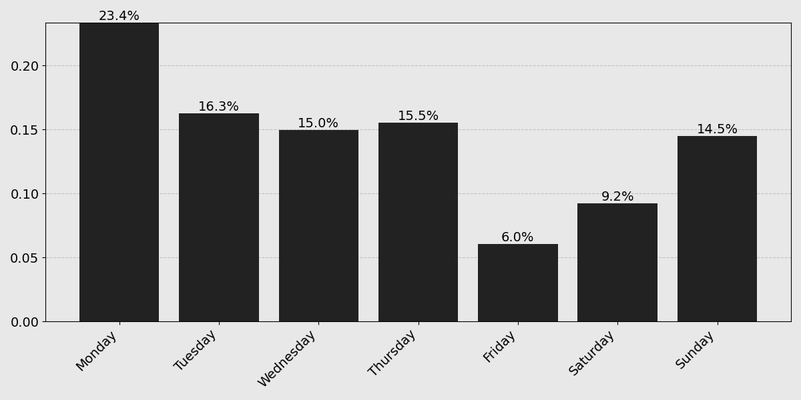

I wrote a decent amount of code this year:

I was curious to see a breakdown of all that activity, so I got to work last night with a Jupyter REPL and Claude in hand. Frustratingly, I was only able to recover 1062/1412 contributions through the API alone, and wasn't able to debug a several hundred commit discrepancy from the over the summer. Whatever.

Also, if you're expecting more pretty pictures like the one above, then you'll probably be disappointed. This isn't that type of blog. Without further ado, my 2024 GitHub Wrapped!
* __[By The Numbers](#by-the-numbers)__
  * [Commits by Repository (>1%)](#commits-by-repository-1)
* __[Work Patterns](#work-patterns)__
  * [Commits by Month](#commits-by-month)
  * [Commits by Day](#commits-by-day)
* __[Under The Hood](#under-the-hood)__
  * [Commits By Programming Language](#commits-by-programming-language)
  * [Commits By Configuration Language](#commits-by-configuration-language)
  * [The Whole Kitchen Sink (>100 lines)](#the-whole-kitchen-sink-100-lines)
* __[Commit Poetry](#poetry)__
  * [Most Frequent Tokens](#most-frequent-tokens)

## By The Numbers

### Commits by Repository (>1%)

    <table class="repo-table">
        <thead>
            <tr>
                <th>Repository</th>
                <th>Percentage</th>
                <th>Type</th>
            </tr>
        </thead>
        <tbody>
            <tr>
                <td class="repo-name">tjbai/evolver</td>
                <td class="percentage-cell">26.6%</td>
                <td>Research</td>
            </tr>
            <tr>
                <td class="repo-name">tjbai/ddm</td>
                <td class="percentage-cell">11.8%</td>
                <td>Research</td>
            </tr>
            <tr>
                <td class="repo-name">tjbai/avlm</td>
                <td class="percentage-cell">10.5%</td>
                <td>Class Project</td>
            </tr>
            <tr>
                <td class="repo-name">tjbai/argo</td>
                <td class="percentage-cell">9.8%</td>
                <td>Research</td>
            </tr>
            <tr>
                <td class="repo-name">tjbai/llmr</td>
                <td class="percentage-cell">8.6%</td>
                <td>Class Project</td>
            </tr>
            <tr>
                <td class="repo-name">tjbai/aoc</td>
                <td class="percentage-cell">4.1%</td>
                <td>Personal</td>
            </tr>
            <tr>
                <td class="repo-name">tjbai/neurstat</td>
                <td class="percentage-cell">3.5%</td>
                <td>Class Project</td>
            </tr>
            <tr>
                <td class="repo-name">tjbai/bstat</td>
                <td class="percentage-cell">3.3%</td>
                <td>Class</td>
            </tr>
            <tr>
                <td class="repo-name">tjbai/ji</td>
                <td class="percentage-cell">3.1%</td>
                <td>Personal</td>
            </tr>
            <tr>
                <td class="repo-name">tjbai/cv</td>
                <td class="percentage-cell">2.9%</td>
                <td>Class</td>
            </tr>
            <tr>
                <td class="repo-name">tjbai/blog</td>
                <td class="percentage-cell">2.4%</td>
                <td>Personal</td>
            </tr>
            <tr>
                <td class="repo-name">tjbai/front</td>
                <td class="percentage-cell">2.0%</td>
                <td>Personal</td>
            </tr>
            <tr>
                <td class="repo-name">tjbai/cogai</td>
                <td class="percentage-cell">1.8%</td>
                <td>Class</td>
            </tr>
        </tbody>
    </table>

Unsurprisingly, the top of this list is dominated by private research repos (evolver, ddm, argo) along with a couple course projects from this past semester (avlm, llmr). Collectively, these are exclusively language model-related research projects—quite a shift from just over a year ago when I was posting things like [PyTorch is Not Pleasant](https://blog.tjbai.com/pytorch-is-not-pleasant). Sign of the times.

Past that, there's a steep fall off and the rest is a mix of random homework repos (bstat, cogai, cv) or personal websites/productivity tools (blog, front, ji). It's funny to see my Advent of Code repo (aoc) in 6th place, considering all those commits came from a 2-3 week period at the start of December.

## Work Patterns

### Commits by Month

I love this chart. My activity steadily ramped up last spring as I got deeper into a project with Jason, briefly dipped during finals in May, then came back during a couple of intense months in Austin where I was juggling both work and research.
Coming back to school, I immediately got really burnt out for pretty much the entire fall, exacerbated by a bad case of "signed an offer letter"-itis. I did manage to get my swagger back to close out the year though between Advent of Code, final projects, and getting back into research.

### Commits by Day

The trend here is really funny to me too. I come into each Monday with a full head of steam, regress to my normal levels of productivity mid-week, then take a couple days of "deserving" rest. Eventually, the Sunday scaries come around to jump start me back into motion.

## Under The Hood

### Commits By Programming Language

    <table class="repo-table">
        <thead>
            <tr>
                <th>File Extension</th>
                <th>Lines Added</th>
                <th>Lines Removed</th>
            </tr>
        </thead>
        <tbody>
            <tr>
                <td class="repo-name">.py</td>
                <td>47,153</td>
                <td>22,638</td>
            </tr>
            <tr>
                <td class="repo-name">.sh</td>
                <td>1,762</td>
                <td>1,084</td>
            </tr>
            <tr>
                <td class="repo-name">.scala</td>
                <td>1,081</td>
                <td>223</td>
            </tr>
            <tr>
                <td class="repo-name">.m</td>
                <td>1,861</td>
                <td>286</td>
            </tr>
            <tr>
                <td class="repo-name">.R</td>
                <td>273</td>
                <td>7</td>
            </tr>
        </tbody>
    </table>

In 2024 I wrote a lot of... Python. I remarked to a friend last spring that using this language is as natural as speaking English to me. In the year since, nothing's really changed and there really isn't a better option/lesser evil than for all my research work. If we account for all the lost commits and notebook development (.ipynb), I'm probably over 100k lines changed on the year.

I did at least pick up Scala late in the year during Advent of Code for a change of scenery and because it's the language of choice at my future employer. Plus, I probably wrote around 10,000 lines of Java over the summer at work. The _most_ shocking part is that I committed exactly 0 lines of JavaScript to any of my websites, including a complete rewrite of this one.

At least 90% of the Bash was autogenerated to queue SLURM jobs on various supercomputers and 100% of the Matlab and R code was written against my will for various homework assignments. We are definitely leaving proprietary scientific computing languages in 2024.

### Commits By Configuration Language

    <table class="repo-table">
        <thead>
            <tr>
                <th>File Extension</th>
                <th>Lines Added</th>
                <th>Lines Removed</th>
            </tr>
        </thead>
        <tbody>
            <tr>
                <td class="repo-name">.json</td>
                <td>755,096</td>
                <td>363,210</td>
            </tr>
            <tr>
                <td class="repo-name">.md</td>
                <td>98,885</td>
                <td>3,211</td>
            </tr>
            <tr>
                <td class="repo-name">.yml</td>
                <td>2,502</td>
                <td>560</td>
            </tr>
            <tr>
                <td class="repo-name">.toml</td>
                <td>1,124</td>
                <td>4</td>
            </tr>
        </tbody>
    </table>

This comparison isn't entirely fair, since a sizeable portion of that JSON came from constant data collection during extended experiments—I'm always really paranoid about not being able to reproduce some result.
Past that, I used JSON quite a bit to manage and version control training/model hyperparameters separately from the source code.
Since the end of the summer I've transitioned entirely to YAML because of its massively improved ergonomics, like in-line commenting.
All the TOML is a byproduct of recently adopting [uv](https://docs.astral.sh/uv/), which uses `pyproject.toml`, as my package manager of choice.

### The Whole Kitchen Sink (>100 Lines Changed)

    <table class="repo-table">
        <thead>
            <tr>
                <th>File Extension</th>
                <th>Lines Added</th>
                <th>Lines Removed</th>
            </tr>
        </thead>
        <tbody>
            <tr>
                <td class="repo-name">.json</td>
                <td>755,096</td>
                <td>363,210</td>
            </tr>
            <tr>
                <td class="repo-name">.vocab</td>
                <td>572,522</td>
                <td>36,710</td>
            </tr>
            <tr>
                <td class="repo-name">.conllu</td>
                <td>590,027</td>
                <td>0</td>
            </tr>
            <tr>
                <td class="repo-name">.ipynb</td>
                <td>189,866</td>
                <td>169,277</td>
            </tr>
            <tr>
                <td class="repo-name">.jsonl</td>
                <td>249,180</td>
                <td>77,642</td>
            </tr>
            <tr>
                <td class="repo-name">.md</td>
                <td>98,885</td>
                <td>3,211</td>
            </tr>
            <tr>
                <td class="repo-name">.py</td>
                <td>47,153</td>
                <td>22,638</td>
            </tr>
            <tr>
                <td class="repo-name">.html</td>
                <td>400</td>
                <td>68,489</td>
            </tr>
            <tr>
                <td class="repo-name">.txt</td>
                <td>24,027</td>
                <td>15,638</td>
            </tr>
            <tr>
                <td class="repo-name">.out</td>
                <td>11,872</td>
                <td>1,797</td>
            </tr>
            <tr>
                <td class="repo-name">.csv</td>
                <td>4,152</td>
                <td>4</td>
            </tr>
            <tr>
                <td class="repo-name">.lock</td>
                <td>3,498</td>
                <td>370</td>
            </tr>
            <tr>
                <td class="repo-name">.yml</td>
                <td>2,502</td>
                <td>560</td>
            </tr>
            <tr>
                <td class="repo-name">.sh</td>
                <td>1,762</td>
                <td>1,084</td>
            </tr>
            <tr>
                <td class="repo-name">.m</td>
                <td>1,861</td>
                <td>286</td>
            </tr>
            <tr>
                <td class="repo-name">.log</td>
                <td>1,620</td>
                <td>1,573</td>
            </tr>
            <tr>
                <td class="repo-name">.css</td>
                <td>1,252</td>
                <td>94</td>
            </tr>
            <tr>
                <td class="repo-name">.scala</td>
                <td>1,081</td>
                <td>223</td>
            </tr>
            <tr>
                <td class="repo-name">.toml</td>
                <td>1,124</td>
                <td>4</td>
            </tr>
            <tr>
                <td class="repo-name">.gen</td>
                <td>906</td>
                <td>906</td>
            </tr>
            <tr>
                <td class="repo-name">.astro</td>
                <td>644</td>
                <td>126</td>
            </tr>
            <tr>
                <td class="repo-name">.dat</td>
                <td>744</td>
                <td>0</td>
            </tr>
            <tr>
                <td class="repo-name">.R</td>
                <td>273</td>
                <td>7</td>
            </tr>
            <tr>
                <td class="repo-name">None</td>
                <td>454</td>
                <td>175</td>
            </tr>
        </tbody>
    </table>

The full picture is a lot less interesting because of the massive amount of data input/output stuff and generated files. This does take me back to some interesting experiments though, like when I was messing around with dependency parses (.conllu) or novel tokenizers (.vocab). I also apparently can't make up my mind between `.log` and `.out` for logging.

## Commit Poetry

### Most Frequent Tokens

    <table class="repo-table">
        <thead>
            <tr>
                <th>Type</th>
                <th>Count</th>
            </tr>
        </thead>
        <tbody>
            <tr>
                <td class="repo-name">fix</td>
                <td>98</td>
            </tr>
            <tr>
                <td class="repo-name">add</td>
                <td>87</td>
            </tr>
            <tr>
                <td class="repo-name">some</td>
                <td>57</td>
            </tr>
            <tr>
                <td class="repo-name">stuff</td>
                <td>56</td>
            </tr>
            <tr>
                <td class="repo-name">update</td>
                <td>52</td>
            </tr>
            <tr>
                <td class="repo-name">config</td>
                <td>43</td>
            </tr>
            <tr>
                <td class="repo-name">added</td>
                <td>36</td>
            </tr>
            <tr>
                <td class="repo-name">eval</td>
                <td>35</td>
            </tr>
            <tr>
                <td class="repo-name">updated</td>
                <td>35</td>
            </tr>
            <tr>
                <td class="repo-name">init</td>
                <td>34</td>
            </tr>
        </tbody>
    </table>

If I had been more consistent with my tenses, then this table would show that I "add" and "added" more than I "fixed," thus proving that I _am_ a good programmer after all. Apparently, I also did a lot of "stuff" in 2024, which is good to finally know for sure.
